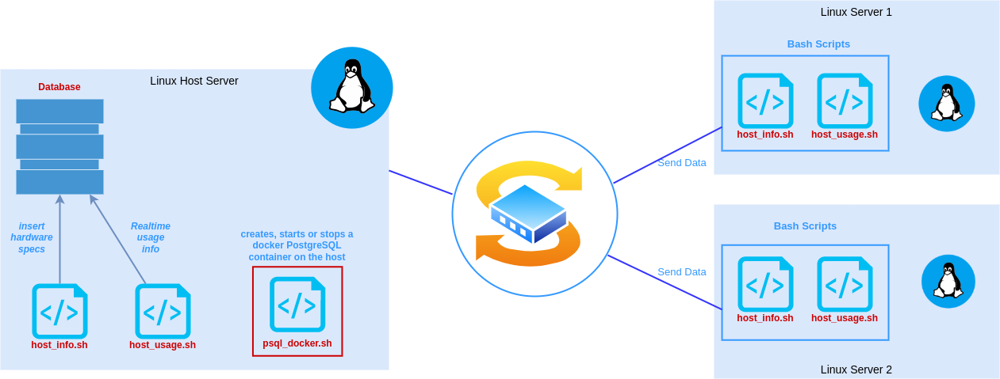
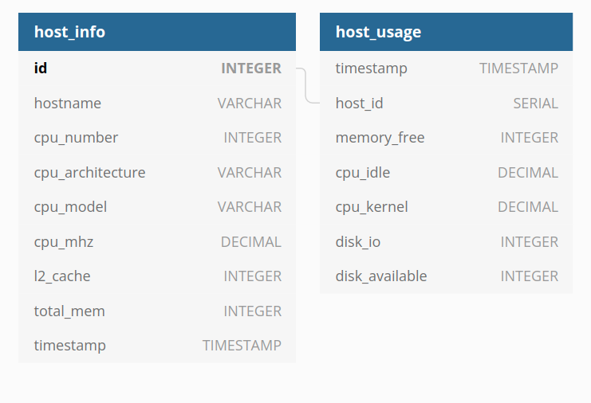

# Linux Cluster Monitoring Agent

## Introduction

The purpose of this project is to design and implement a cluster that will help the Jarvis Linux Cluster Administration team to manage multiple Linux clusters running on CENTOS 7.
This project is going to allow the LCA to keep track of each node’s hardware characteristics and monitor resource utilization in real time saved in a relational database management system. This project is built using Linux command lines, Bash scripts, PostgreSQL, Docker and Git

## Table of contents

<hr>

- [Introduction](#introduction)
- [Quick Start](#quick-start)
- [Implemenation](#implemenation)
  - [Architecture](#architecture)
  - [Scripts](#scripts)
  - [Database Modeling](#database-modeling)
- [Test](#test)
- [Improvements](#improvements)
- [Author](#author)

## Quick Start

<hr>

- ### Scripts usage

```
./scripts/psql_docker.sh start|stop|create [db_username] [db_password]

# example : create the container
./scripts/psql_docker.sh create postgres password

# example :  starting the container
./scripts/psql_docker.sh start postgres password
```

- ### Creating a database

```
psql -h localhost -p 5432 -U postgres -W -c "CREATE DATABASE db_name;"

# Database initialization : Creating tables using ddl.sql
psql -h localhost -p 5432 -U postgres -d [db_name] -f sql/ddl.sql

# example : psql -h localhost -p 5432 -U postgres -d host_agent -f sql/ddl.sql
```

- ### Collect and insert hardware specs data into the psql database using `host_info.sh`

```
./scripts/host_info.sh localhost 5432 host_agent postgres password
```

- ### Collect and insert server usage data into the psql database using `host_usage.sh`

```
./scripts/host_usage.sh localhost 5432 host_agent postgres password
```

- ### Execute `host_usage.sh` every minute, so it collects data continuously.

```
# edit crontab jobs
crontab -e

# add to crontab and use path to host_usage.sh
* * * * * bash [/path_to_host_usage/host_usage.sh] localhost 5432 host_agent postgres password > /tmp/host_usage.log
```

## Implemenation

<hr>

- ### Architecture

<div align="center">
<p align="center" style="width:90%;">
  
</p>
</div>

- ### Scripts

  - `psql_docker.sh` takes 5 arguments `create`, `start`, `stop`, `password` and `username`. This script allow to easuly create, start or stop the docker container with postgres server.

    ```
    ./scripts/psql_docker.sh start|stop|create [db_username] [db_password]
    ```

  - `ddl.sql` This script create `host_info` and `host_usage` tables in the docker container. First, you have to create a database within the PostgreSQL server.

  - `host_info` collects the hardware specifications of the machine

    - `hostname` : get the system hostname
    - `cpu_number` : number of cpu cores
    - `cpu_architecture` : cpu architecture
    - `cpu_model` : get the cpu model
    - `cpu_mhz` : cpu clock rate
    - ` L2_cache` : cpu cache memory
    - `total_mem` : total memory in KB
    - `timestamp` : day and time in UTC

  - `host_usage` collects the usage info of the host

    - timestamp : get day and time in UTC
    - host_id : get the `id` from the `host_info` table
    - memory_free : current free memory
    - cpu_idle : Percentage of cpu that is currently not being used by any program.
    - cpu_kernel : Percentage of cpu kernel
    - disk_io : The speed with which the data transfer takes place between the hard disk drive and RAM
    - disk_available : disk space that is currently available

- ### Database Modeling
  <div align="center">
    <p align="center" style="width:70%;">
      
    </p>
  </div>

## Test

- The `psql_docker.sh` script was tested by building and running the container and using docker ps -a to verify that this was the case. Tests were also done to make sure all the arguments were provided.

- The `host_info` and `host_usage` scripts were tested by compparing inserted data to the data from `/proc/cpuinfo`, `free`, `lscpu`, `vmstat` , and `uname` commands.

- The `ddl.sql` script was tested by running it in the terminal and checking if the tables were created in the database

- The `queries.sql` script was tested by inserting sample values into the `host_info` and `host_usage` tables and checking if the tables were successfully created.

## Improvements

<hr>

- Use docker compose: It's clean and easy to maintain
- Write additional SQL queries in queries.sql to showcase potential business value.

## Author

<hr>

- Website - [Saliou](https://salihou.netlify.app/)
- Linkedin - [@Saliou](https://www.linkedin.com/in/saliou-diop-527741112/)
